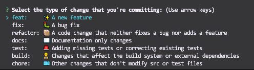
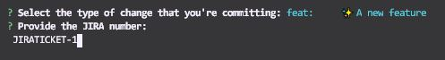
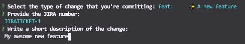
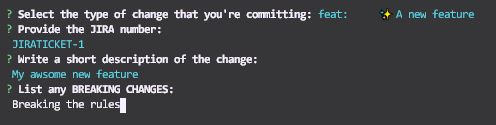

# Cockpit TherapScoreRulesWidget

For a functional description of this Widget, please visit:

[link](https://glinttdev.atlassian.net/wiki/spaces/SC/pages/123456)

## Getting Started

These instructions will get you a copy of the project up and running on your local machine for development and testing purposes.

### **Mandatory Prerequisites**

**Required Software**

-   [Git](https://git-scm.com/)
-   [NodeJS (> 13.0)](https://nodejs.org/en/download/current/)
-   [Visual Studio Code](https://code.visualstudio.com/)

**MacOS Only**

It's mandatory to have brew installed for MacOS!

-    [Brew](https://brew.sh/)

Run the following command in the terminal:

```
/bin/bash -c "$(curl -fsSL https://raw.githubusercontent.com/Homebrew/install/HEAD/install.sh)"
```

**Windows Only**

It's mandatory to have choco and Makefile installed for Windows!

-   [Choco](https://chocolatey.org/)

Open porwershell (run as administrator) and run the following commands:

```
Set-ExecutionPolicy Unrestricted
```
```
Set-ExecutionPolicy Bypass -Scope Process -Force; [System.Net.ServicePointManager]::SecurityProtocol = [System.Net.ServicePointManager]::SecurityProtocol -bor 3072; iex ((New-Object System.Net.WebClient).DownloadString('https://chocolatey.org/install.ps1'))
```

After installing choco, you can now install Makefile.

-   [Makefile](https://community.chocolatey.org/packages/make)
```
choco install make
```

### Installing

Clone the repo either with

```
git clone git@bitbucket.org:glintt_sws/therap-score-rules-widget.git
```

or

```
git clone https://<username>@bitbucket.org/glintt_sws/widget-bolierplate.git
```

Run the command from the project root:

```
make setup-dependencies
```

It will instal all needed Project dependencies and VS Code Extension for widgets.

For more information visit [core-js startup README](https://bitbucket.org/glintt_sws/core-js/src/master/packages/startup/README.md).

### Running the project

This project has 2 ways of running for development depending if you wan't to mainly run it on Docker or not.

#### For Docker development

```
yarn dev
```

or 

```
yarn dev:build <- It will force container rebuild with the most recent dependencies
```

Navigate to http://localhost:3000 and enjoy. :rocket:

#### For app development

```
yarn dev:local
```

Navigate to http://localhost:3000 and enjoy. :rocket:

### Running the project the same way it will run in production on Docker

```
yarn prod
```

Navigate to http://localhost:3000 and enjoy. :rocket:

## Running the tests

Tests are a mandatory and extremelly important part of this widget.

Unit tests places inside tests/unit folder can be executed with

```
yarn test:unit
```

End to End tests places inside tests/e2e folder can be executed with

Note: e2e tests require application to be running, so run **yarn dev** before **yarn test:e2e** or before commiting the code

```
yarn test:e2e
```

After **yarn test:unit** a coverage report is generated at /coverage/lcov-report/index.html with full information of every file code coverage.
Rules are applied so a 100% of Statements/Branches/Functions/Lines must be covered in order to proceed and commit the code.
After **yarn test:e2e** a report is generated at /out/report.json with full information of test run execution.

## Commit the Code

After adding all your files finish with the command:

```
yarn commit
```

Note: It's important that the code is commited with this command so every pre-commit hook and lint-staged is executed. Any commit done without this utility will not be approved by Code Reviewers.






This will guide you through a few steps to create a commit message according to [conventional commits](https://www.conventionalcommits.org/). Keep in mind this is mandatory and required for all the process between Bitbucket -> Jenkins -> Jira.

After all the static code checks and passed tests, your code is ready to push.

**Trying to skip the tests or the eslint validations or the conventional commits will break the build :boom: :boom: in the repository preventing the code to be merged, so play fair.**

## Build and Deploy

Simply run the command

```
yarn build
```

A static build will be generated to /build and can be deployed anywhere.

## Package Json Structure 

````
{
    "name": "therap-score-rules-widget",
    "version": "0.1.0",
    "private": true,
    "dependencies": {
        # Project Dependencies #
    },
    "scripts": {
        # Project Scripts to build, start, test, etc  #
    },
    "browserslist": {
        # List of Browsers for code to auto transpile css (usually rules are defined by environment) #
    },
    "babel": {
        # Babel presets and plugins for code transpilation #
    },
    "eslintConfig": {
        # Static Code check rules #
    },
    "prettier": {
        # Code identation rules #
    },
    "config": {
        "commitizen": {
            # Tool to enforce usage of Conventional Commits #
        }
    },
    "husky": {
        # Runs commands on pre or post commit hooks #
    },
    "lint-staged": {
        # Specifies what files and which commands should execute in parallel #
    },
    "engines": {
        # Node and Yarn versions supported (yarn or scripts will not execute if versions are not installed) #
    },
    "os": [
        # OS supported (yarn or scripts will not execute if versions are not installed) #
    ]
}
````

## License

This project is licensed under the ISC License - see the [LICENSE.md](LICENSE.md) file for details

